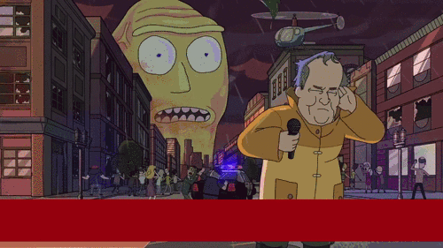

# 1. Jams and Pitching

- Time-constrained event to create apps/games around a theme
- Strong Pitch: Attracts skilled teammates and defines your idea
- Weak Pitch: No team, solo misery, or add your skills to another team

> **Meme**: "Show me what you got" Your Pitch

---

# 2. Understanding Your Audience

- Fellow jam participants looking for projects to join
- They want exciting ideas, matching skills, and clear leadership
- You might pick up stragglers from failed pitches

> **Meme**: "Disaster Girl" with text: "Half Formed team / Recruitment Oppertunity"

---

# 3. Crafting Your Plan

## Define Your Game Idea

- Summarize core concept: genre, mechanics, story
- Connect to jam theme or show flexibility
- Be concise but complete

> **Meme**: Drake meme format: rejecting "vague concept", approving "clear game idea"

---

## Highlight Unique Aspects

- Identify your hook: novel mechanic or creative twist
- Stand out from typical jam projects
- Make people say "I want to work on that!"

> **Meme**: Galaxy brain meme showing evolution of game mechanics from basic to mind-blowing

---

## Outline Roles Needed

- List specific roles and responsibilities
- Specify platforms and technologies
- Show you've thought about team composition

> **Meme**: Avengers "I need heroes" recruitment poster with game dev roles

---

## Show Leadership and Vision

- Share your jam goals: winning, learning, portfolio building
- Demonstrate feasibility within timeframe
- Project confidence in your management skills

> **Meme**: "I'm something of a project manager myself" (Norman Osborn meme)

---

# 4. Delivering Your Pitch

- Start with a hook that grabs attention
- Use storytelling and visuals when possible
- Keep it under 5 minutes total

> **Meme**: "Pitch too long? Ain't nobody got time for that!"

---

# 5. Handling Questions and Feedback

- Prepare for common questions about theme, feasibility, tech
- Show flexibility and openness to collaboration
- Don't be defensive about your precious idea

> **Meme**: "Change my mind" Steven Crowder meme: "Feedback makes your game better"

---

# 6. Building Your Team

- Be approachable after pitching
- Evaluate both skills and team chemistry
- Recognize enthusiasm trumps perfect credentials

> **Meme**: "This is fine" dog in burning room: "When your team agrees to an impossible feature scope"

---

# Quick Reference

- Clear concept tied to theme
- Highlight your unique hook
- Define roles and tasks specifically
- Set vision and goals
- Keep pitch under 5 minutes

> **Meme**: "Here's the plan" pointing at whiteboard with increasingly chaotic diagrams
